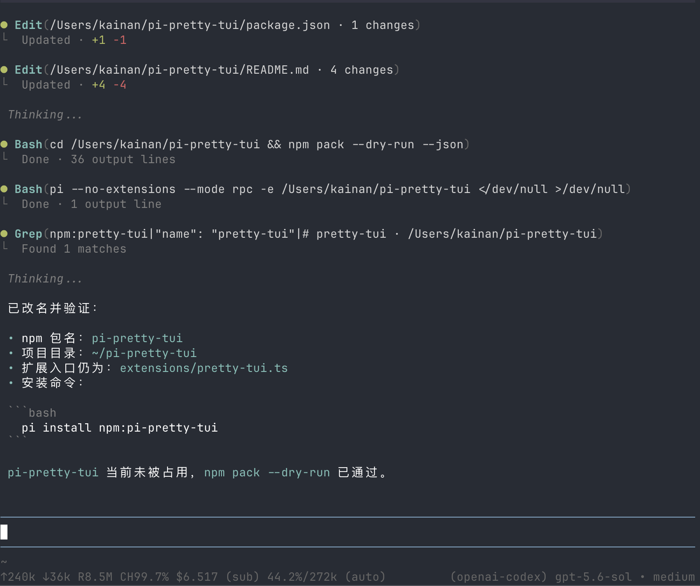

# pi-pretty-tui

A visual refinement extension for the [Pi coding agent](https://pi.dev/). It provides compact tool-call rendering and cleaner list presentation while preserving Pi's built-in tool behavior.



## Features

- Compact `Read`, `Bash`, `Edit`, `Write`, `Grep`, `Find`, and `List` calls
- Gray running, green success, and red failure indicators
- Concise result summaries with expandable output
- Native-style `Write` previews: first 10 lines when collapsed, full content when expanded
- Live `Bash` output: latest 5 lines when collapsed, all available output when expanded
- Switchable `full`, `compact`, and `clean` rendering modes with persistent settings
- Clean mode hides thinking blocks (including Pi's standalone `Thinking...` placeholder) while collapsed and reveals the original thinking content when expanded
- Colored `+added` and `-removed` edit statistics and diffs
- Correct hanging indentation for long paths and wrapped tool output
- Bullet (`•`) markers for unordered Markdown lists

## Install

```sh
pi install npm:pi-pretty-tui
```

Restart Pi or run `/reload` after installation.

Pi may warn that built-in tools are being overridden. This is expected: pi-pretty-tui re-registers Pi's built-in tools and delegates execution to their original implementations, changing only their TUI renderers.

## Rendering modes

Run `/pretty-tui` to choose a mode interactively, or set one directly:

```text
/pretty-tui full
/pretty-tui compact
/pretty-tui clean
/pretty-tui status
```

- `full` (default): show the complete Bash command, the latest 5 output lines when collapsed, and all available output when expanded.
- `compact`: when collapsed, show only the first Bash command line plus an omitted-line count and only `Running…`, `Done`, or `Command failed` for the result. Press `Ctrl+O` to reveal the complete command and all available output.
- `clean`: collapse supported tool calls into a single `Working(...)` status; while a tool is running, the activity slot shows its name, such as `Working(3 tool calls · Read)`, then changes to `thinking...` or `done`. Visible assistant text starts a new tool group, so later calls get a separate status. Collapsed thinking blocks stay hidden without Pi's `Thinking...` placeholder; press `Ctrl+O` to reveal thinking content and normal expanded tool calls/output in transcript order.

Clean mode covers the built-in tools managed by this package: `read`, `bash`, `edit`, `write`, `grep`, `find`, and `ls`. Third-party tools keep their own rendering.

The selected mode applies immediately and persists in `~/.pi/agent/pretty-tui.json` (or the directory selected by `PI_CODING_AGENT_DIR`).

## Expand tool output

Press `Ctrl+O` (Pi's default `app.tools.expand` keybinding) to show or hide detailed output, edit diffs, complete `Write` content, full tool details, and thinking content in `compact` or `clean` mode.

## Compatibility notice

Tool rendering uses Pi's documented extension APIs. Clean thinking and active-tool state follow Pi's built-in expansion and execution transitions through its exported interactive components. Changing unordered-list markers currently requires runtime patching of an internal `@earendil-works/pi-tui` Markdown renderer method because Pi does not expose a public hook for that presentation detail. Code blocks use Pi's original renderer without modification.

No Pi source files are modified. The list-marker patch is removed during session shutdown, but a future Pi release may require this extension to be updated.

## Uninstall

```sh
pi remove npm:pi-pretty-tui
```

Then restart Pi.

## License

MIT
